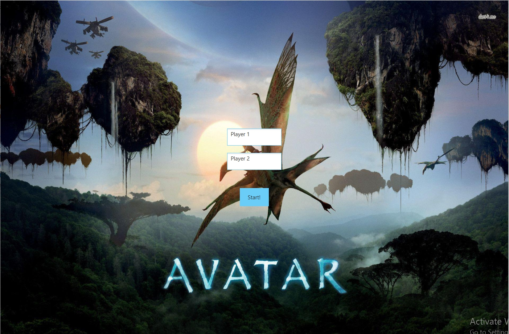
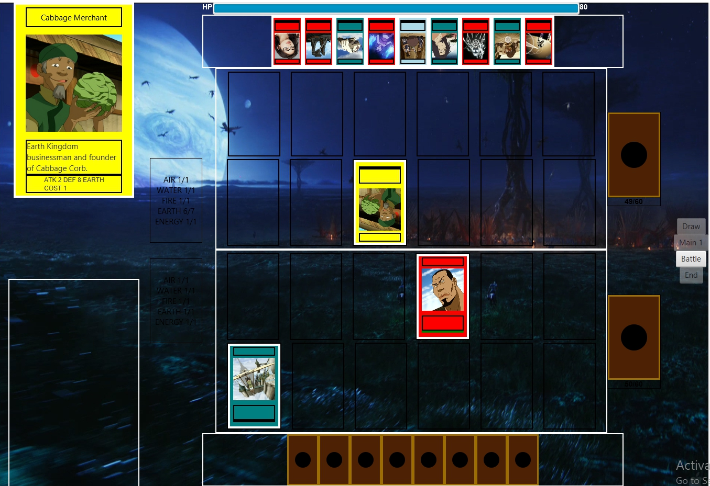

## Avatar Card Game

## Description

A simple game card based on the Avatar universe, using javafx for the interface, and wrapped by gradle.

## Struktur kode
```
root
└── src/main
    └── java/com/avatarduel
        ├── card
        │   ├── Aura.java
        │   ├── Card.java
        │   ├── CardLoader.java
        │   ├── Character.java
        │   ├── Destroy.java
        │   ├── Element.java
        │   ├── HasCost.java
        │   ├── Land.java
        │   ├── PowerUp.java
        │   └── Skill.java
        ├── controller
        │   ├── FieldController.java
        │   └── HandController.java
        ├── deck
        │   └── Deck.java
        ├── gui
        │   ├── Buttons.java
        │   ├── CardView.java
        │   ├── FieldSide.java
        │   ├── FieldView.java
        │   ├── HandView.java
        │   ├── HealthView.java
        │   ├── MainView.java
        │   └── RegView.java
        ├── player
        │   └── Player.jav
        ├── state
        │   ├── State.java
        │   └── Phase.java
        ├── util
        │   └── CSVReader.java
        └── AvatarDuel.java

```
## Screenshots




## How to start the game
0. 'gradlew' untuk memastikan gradle terpasang
1. 'gradlew run' game akan mulai


## Tambahan
- Dokumentasi tersedia di build/documentations/index.html setelah command 'gradlew build'